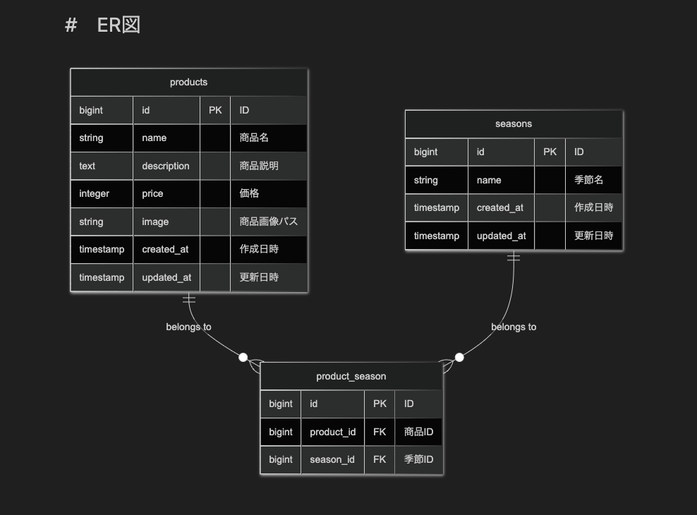

# 環境構築

## Dockerビルド
* git clone https://github.com/hana20210115/mogitate.laravel.git
cd mogitate.laravel
* cp .env.example .env
docker run --rm \
      -u "$(id -u):$(id -g)" \
      -v "$(pwd):/var/www/html" \
      -w /var/www/html \
      laravelsail/php83-composer:latest \
      composer install --ignore-platform-reqs
* ./vendor/bin/sail up -d --build

## Laravel環境構築
* ./vendor/bin/sail artisan key:generate
* ./vendor/bin/sail artisan storage:link
* ./vendor/bin/sail artisan migrate
* ./vendor/bin/sail artisan db:seed

# 使用技術
* プログラミング言語: PHP 8.5.3 (Laravel sail)
* フレームワーク: Laravel 10.50.2 / 11.x
* データベース: MySQL 8.4.8
* UIデザイン: Tailwind CSS (UIデザイン)

# 開発環境
* 商品一覧画面　http://localhost/

